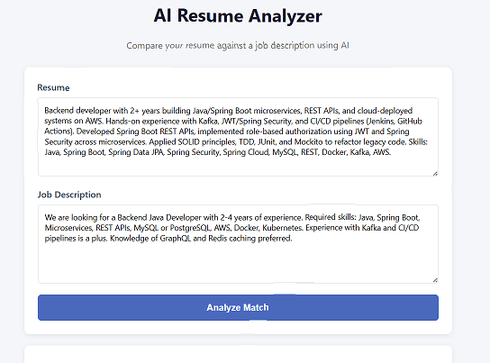
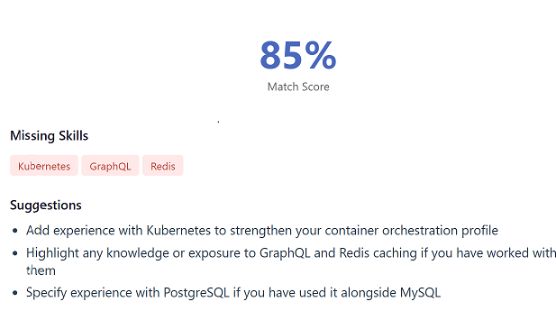

# AI Resume Analyzer

A Spring Boot REST API that analyzes how well a resume matches a job description using Google's Gemini API. Returns a match score, missing skills, and actionable suggestions — then persists each analysis to MySQL. Includes a simple web UI for easy demoing.

## Screenshot

**Input Form**


**Analysis Result**


## Features
- Compare resume text against a job description
- AI-generated match score (0-100)
- Identifies missing skills relevant to the role
- Suggests concrete resume improvements
- Persists analysis history to MySQL
- Simple browser-based UI, no separate frontend setup needed

## Tech Stack
- **Backend**: Java 17, Spring Boot 3.x
- **Persistence**: Spring Data JPA, MySQL
- **AI Integration**: Google Gemini API
- **Validation**: Jakarta Bean Validation
- **Frontend**: Plain HTML/CSS/JS (served as a static resource)
- **Build Tool**: Maven

## Architecture
Client → Controller → Service Layer → Gemini API
│
▼
Repository (JPA)
│
▼
MySQL
**Flow:**
1. Client sends resume + job description to `POST /api/analyze`
2. `PromptBuilder` constructs a structured prompt
3. `GeminiService` calls the Gemini API and returns raw text
4. `AnalysisService` parses the JSON response, persists it, and converts it into a clean response DTO
5. Structured result (score, missing skills, suggestions) returned to client as real JSON arrays

## Web UI

A simple browser-based UI is available at the root URL (`http://localhost:8080`) — paste a resume and job description, click "Analyze Match," and view the score, missing skills, and suggestions directly in the browser.

## API Example (Postman)

**Endpoint:** `POST http://localhost:8080/api/analyze`

**Request Body:**
```json
{
  "resumeText": "Java developer with Spring Boot experience, REST APIs, MySQL, AWS...",
  "jobDescription": "Looking for a backend engineer with Java, Spring Boot, AWS, Docker..."
}
```

**Response:**
```json
{
  "id": 1,
  "matchScore": 78,
  "missingSkills": ["Kubernetes", "GraphQL", "Redis"],
  "suggestions": ["Add a project demonstrating cloud deployment", "Highlight Docker experience"],
  "createdAt": "2026-08-09T10:30:00"
}
```

## Setup

1. Clone the repo
```bash
   git clone https://github.com/yourusername/resume-analyzer.git
```
2. Create a MySQL database:
```sql
   CREATE DATABASE resume_analyzer;
```
3. Set your Gemini API key as an environment variable:
```bash
   export GEMINI_API_KEY=your_key_here
```
4. Update `application.properties` with your MySQL credentials
5. Run the application:
   - **Via IDE** (IntelliJ/STS/Eclipse): import as a Maven project and run `ResumeAnalyzerApplication.java`, with `GEMINI_API_KEY` set in your run configuration's environment variables
   - **Via terminal**: `./mvnw spring-boot:run` (after exporting `GEMINI_API_KEY` in that shell session)
6. Open `http://localhost:8080` in your browser to use the UI, or call `/api/analyze` directly via Postman/curl

## Design Notes
- Prompt construction is isolated from the API call layer (`PromptBuilder` vs `GeminiService`) — swapping LLM providers only requires changing one class
- `missingSkills`/`suggestions` are stored as JSON strings in the DB for v1 simplicity, and converted to proper JSON arrays via a response DTO (`AnalysisResponse`) — keeping the DB schema and API contract decoupled
- Centralized exception handling via `@RestControllerAdvice` for clean error responses

## Future Improvements
- Docker containerization
- AWS deployment
- File upload (PDF parsing) instead of plain text input
- Analysis history view in the UI
